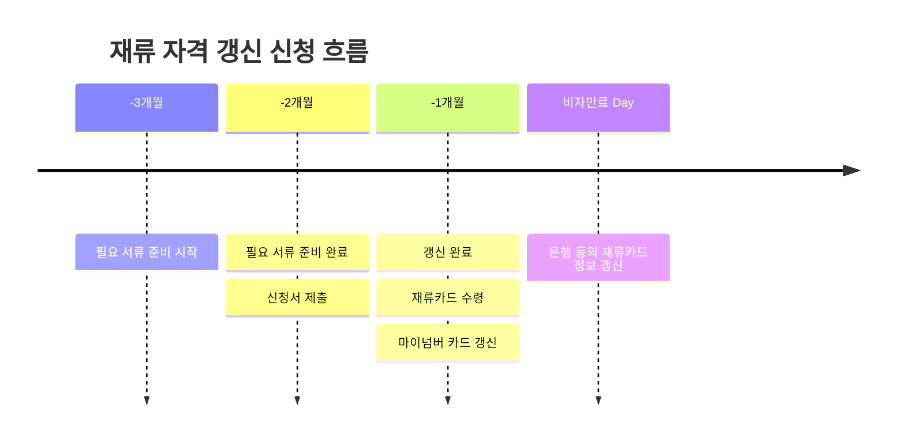

<!--title -->
# 일본 재류 비자 갱신 서류 준비하기 
<!--//title -->

<!-- 
```json
{
  "author": "Onigiri.J",
  "createdAt": "2024-08-02",
  "updatedAt": "2024-08-16"
}
``` 
-->

```yaml
  author: Onigiri.J
  createdAt: 2024-08-02
  updatedAt: 2024-08-16
```

---




--- 

## 1. 전제

  ```yaml
    비자종류: 技術・人文知識・国際業務
    소속기관: カテゴリー2
    갱신횟수: 1회(2회째 신청)
  ```


## 2. Check List

  - [「在留資格「技術・人文知識・国際業務」 비자의 신청서별 준비물 안내](https://www.moj.go.jp/isa/applications/status/gijinkoku.html)

    | No | - | 항목 | 수량 | 비고 |
    | --- | --- | --- | --- | --- |
    | 1 | 필수 | 비자 갱신 신청서(在留期間更新許可申請書) | - | 개인용 및 소속기관용, 총 4장 |
    | 2 | 필수 | 증명사진 ([증명사진규정](https://www.moj.go.jp/isa/applications/status/photo_info_00002.html)) | 1 | 3cm * 4cm (가로*세로), 6개월 이내 |
    | 3 | 필수 | 여권 | 1 | 제출 X |
    | 4 | 필수 | 재류카드 | 1 | 제출 X |
    | 5 | 필수 | 소속기관 카테고리 증명서류 | - | 취업한 회사의 카테고리 증명 서류 |

    ※ 위의 항목 외에 추가적인 서류가 필요할 경우도 있다.
      + 추가적인 서류가 필요할 경우, 신청서 접수 후, 나중에 入館에서 추가 서류 요청이 올 수도 있음
        - 심사 기간이 더 길어지므로 필요하다고 생각하는 서류는 모두 준비해서 한번에 제출하는 편이 효율적
      + 예) _전년도 원천징수표, 납세증명서, (이직했을 경우) 전 직장의 퇴직 증명서 및 현 직장의 고용계약서 등_ 


## 3. 필요 서류 준비

### 1) 비자 종류 확인

  - **재류카드(在留カード)의 재류자격(在留資格) 확인**

  비자 종류에 따라 준비해야할 서류와 절차가 달라지므로, 아래의 페이지를 참고해서 준비해야 한다.

  - [비자 종류에 따른 비자 갱신 신청 방법](https://www.moj.go.jp/isa/applications/procedures/16-3.html)

### 2) 소속 기관 카테고리 확인

  - **현재 취업해 근무하고 있는 회사의 카테고리를 확인**

  - **소속 기관**: 일본에서 현재 취업해 근무하고 있는 회사 및 단체
    + [「技術・人文知識・国際業務」비자의 소속 기관별 갱신 신청에 필요한 서류 안내](https://www.moj.go.jp/isa/applications/status/gijinkoku.html)

  - 카테고리별 **조건을 1개라도 충족한다면** 그 카테고리의 필요 서류만 준비해도 무방
    + 예) _현재 취업해 근무하는 회사가 상장기업이라면 다른 조건 필요없이 "카테고리 1"에 해당_
    + 취업한 회사가 어느 카테고리에 해당하는지 회사에 직접 물어보는 편이 가장 정확함

### ✔️ 소속기관 변경 신청
  
  - 외국인이 일본에서 취업할 경우, 소속 기관(취업해서 근무하는 회사)의 변경이 있을 시 항상 신고해야한다. 
    + [소속기관 변경 신청 사이트](https://www.ens-immi.moj.go.jp/NA01/NAA01S/NAA01STransfer)
    + 현재 회사가 비자를 발급 받았을 때 또는 이전에 갱신했을 때의 회사가 아니라면(이직했다면) 소속 기관 변경 신청이 필요
    + [소속 기관 변경 신청 방법](#TODO)
  
  - 신청 후 2~3일 이내에 처리가 완료되므로 비자 갱신 신청 접수 전까지 충분히 가능하다

### 3) 비자 갱신 신청서 작성

  - [「在留資格「技術・人文知識・国際業務」 비자의 신청서별 준비물 안내](https://www.moj.go.jp/isa/applications/status/gijinkoku.html) 에서 다운 받을 수 있다.
    + 직접 쓰지 않고 엑셀로 작업한 뒤, 프린트해도 무방

  #### 3-1) 개인 작성 분 (본인이 작성)

    > "在留期間更新許可申請書" 파일의 申請人用 페이지

    - 주요 항목에 대한 설명 및 예시

      | 항목 | 설명 | 비고 |
      | --- | --- | --- |
      | 国籍・地域 | 신청자의 국적 | _예) 韓国_ |
      | 氏名 | 신청자의 이름 | _예) HONG GILDONG_ |
      | 配偶者の有無 | 배우자 유무 | - |
      | 職業 | 신청자의 직업 | _예) 会社員_ |
      | 本国における居住地 | 한국에서의 주소지 | _예) Seoul-si_ |
      | 住居地 | 일본에서의 주소 | 주민표 상의 주소를 기재 |
      | 電話番号 | 일본 집 전화번호 | 없다면 _該当なし_ |
      | 携帯電話番号 | 일본 휴대폰 번호 | - |
      | 旅券 - (1)番号 | 신청자의 여권번호 | - |
      | 旅券 - (2)有効期限 | 신청자의 여권 유효기간 | - |
      | 現に有する在留資格 | 신청자의 현재 비자 종류 | _예) 技術・人文知識・国際業務_ |
      | 在留期間 | 현재 비자의 재류기간 | _예) 1年_ |
      | 希望する在留期間 | 이번 갱신 신청에 희망하는 재류기간 | _예) 3年_ |
      | 更新の理由 | 비자 갱신 이유 | _예) 引き続き○○社で働くため_ |
      | 在日親族 | 일본에 재류 중인 가족, 동거인 정보 | 일본에 살고 있는 가족이나 주민표 상 동거인 |
      | 勤務先 - (1)名称 | 신청자의 근무 회사명 | _예)株式会社○○_ |
      | 勤務先 - (1)支店・事業所名  | 신청자의 근무 지점명 | _예)本社_ |
      | 勤務先 - (2)所在地  | 신청자의 근무 회사 주소 | - |
      | 勤務先 - (3)電話番号 | 신청자의 근무 회사 전화번호 | - |
      | 情報処理技術者資格又は試験合格の有無 | 정보처리기사 자격 유무 및 자격명 | _예)韓国：情報処理技師_ |
      | 職歴 | 신청자의 이력 정보 | - |

      ※ 서류의 서명란에 서명을 잊지 않도록 한다.

  #### 3-2) 소속 기관 작성분 (회사가 작성)

    > "在留期間更新許可申請書" 파일의 所属機関用 페이지

    - 주요 항목에 대한 설명 및 예시

      | 항목 | 설명 | 비고 |
      | --- | --- | --- |
      | 契約又は招へいしている外国人の氏名 | 신청자의 성명 | - |
      | 契約の形態 | 신청자의 계약 형태 | - |
      | 所属機関等勤務先 - (1)名称  | 회사명 | - |
      | 所属機関等勤務先 - (2)法人番号 | 회사의 법인번호 | 13桁, 법인번호 검색사이트](https://www.houjin-bangou.nta.go.jp) |
      | 所属機関等勤務先 - (3)支店・事業所名 | 지점 및 영업소명 | - |
      | 所属機関等勤務先 - (4)雇用保険適用事業所番号 | 고용 보험 적용 사업소 번호 | 11桁 |
      | 所属機関等勤務先 - (5)業種  | 회사의 업종 | - |
      | 所属機関等勤務先 - (6)所在地 | 회사 주소 | - |
      | 所属機関等勤務先 - (7)資本金 | 회사의 자본금 | [자본금 검색사이트](https://www.buffett-code.com/company) |
      | 所属機関等勤務先 - (8)年間売上高（直近年度） | 회사의 연간 매출금 | 가장 최근 정보 |
      | 所属機関等勤務先 - (9)従業員数 | 회사의 종업원 정보 | - |
      | 雇用開始（入社）年月日 | 채용일자 | - |
      | 給与・報酬（税引き前の支払額） | 급여정보 | - |
      | 実務経験年数  | 경력연수 | 현재까지 관련 업종에서 근무한 경력 <br /> _예) 3年_  |
      | 職務上の地位（役職名） | 신청자 직위 | - |
      | 職種 | 회사의 직종 | - |
      | 活動内容詳細 | 회사에서 신청자의 근무 내용 | - |

      ※ 회사가 자본금이나 매출 등의 정보를 알려주지 않는 경우도 있었다. 회사 사이트나 인터넷에서 대략적인 정보를 찾아 기입했다.

      ※ 회사의 대표자(사장)의 인감 등은 필요없다.


## 4. 개인 준비 서류

  > 신청서 이외에 준비할 서류

  - 필수 준비 서류에 대한 설명 및 예시(소속기관이 카테고리2에 해당할 경우)

    | 항목 | 설명 | 비고 |
    | --- | --- | --- |
    | 증명사진 | 신청서에 붙일 사진 | 3cm * 4cm |
    | 여권 | 신청시에 제시 | 제출하지 않는다. |
    | 재류카드 | 신청시에 제시 | 제출하지 않는다. |

  - 그외 서류
    + 비자 갱신 신청서를 접수한 뒤 入館에서 추가 서류를 요청할 수도 있다. 필요하다고 생각되는 모든 서류를 함께 제춣하는 것이 효율적이다

    | 항목 | 설명 | 비고 |
    | --- | --- | --- |
    | 납세증명서 | 주민세 등 세금 증명서 | 구약소 등에서 받을수 있다. |
    | 고용계약서 | 입사시 계약 내용이 기재된 계약서 사본 | - |
    | 졸업증명서 | 최종 학력 졸업 증명서 사본 | - |
    | 졸업증명서 번역본 | 영사관에서 공증 받은 졸업 증명서 번역본 | - |
    | 정보처리기사 자격증 | 관련 자격증 사진 | - |
    | 정보처리기사 자격증 번역본 | 영사관에서 공증 받은 자격증 번역본 | - |
    | 離職票 | (이직을 했다면)이직표 사본 | 타입1, 2 모두 제출 |
    | 원천징수표 | 이전 직장에서의 원청징수표 사본 | 전년도 혹은 올해 이직을 한 경우 |
    | 退職証明書 | 이전 직장에서 퇴직했다는 증명서 | 이전 직장에서 받을 수 있다. |

    ※ 퇴직증명서는 이전 직장에서 발급 받을 수 있으나 만약 받지 못할 경우에는 「事情説明書」를 작성해 제출한다.
      + **事情説明書**: 자유 양식으로 간략하게 퇴직증명서를 제출하지 못한 이유를 기술한다. 
      + [退職証明書とは？ もらえないときは？ 離職票との違いや対処法](https://www.vbest.jp/roudoumondai/columns/7441/)


## 5. 소속 기관 준비 서류

  > 카테고리에 해당하는 회사임을 증명하기 위해 회사에서 받을 서류

  - 소속기관이 카테고리2에 해당할 경우

    | 항목 | 설명 | 비고 |
    | --- | --- | --- |
    | 前年分の職員の給与所得の源泉徴収票等の法定調書合計表 | 전년도 원천징수액이 1,000만엔 이상인가 확인 | - |
    | 受付印 | 세무서 또는 납세 시스템에 제출한 접수표 또는 접수 완료 메일 복사본 |  |


<br /><br /><br /><br /><br />

---
- Refs
  + [在留期間更新許可申請-재류 기간 갱신 허가 신청](https://www.moj.go.jp/isa/applications/procedures/16-3.html)
  + [[온라인비자] 온라인 일본 비자 신청으로 우편으로 재류카드 받고](https://bemeke.tistory.com/2)
  + [도쿄 출입국 재류 관리국 신청 예약 시스템의 안내(개요)](https://www.moj.go.jp/isa/about/region/tokyo/shinsei_yoyaku_summary.html)
  + [소속 기관 변경 신청](https://www.ens-immi.moj.go.jp/NA01/NAA01S/NAA01STransfer)