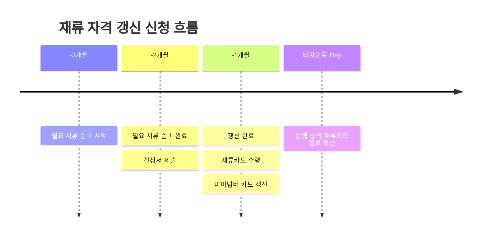

<!--title -->
# 일본 재류 비자 갱신 신청하기
<!--//title -->

<!-- 
```json
{
  "author": "Onigiri.J",
  "createdAt": "2024-08-02",
  "updatedAt": "2024-08-16"
}
``` 
-->

```yaml
  author: Onigiri.J
  createdAt: 2024-08-02
  updatedAt: 2024-08-16
```

---




--- 

## 1. 전제

  ```yaml
    비자종류: 技術・人文知識・国際業務
    소속기관: カテゴリー2
    갱신횟수: 1회(2회째 신청)
  ```

## 2. 재류 비자 갱신 신청 방법들

### 1) 온라인 접수

  반드시 入館에 가지 않고도 재류 비자 갱신 신청이 가능하다. 다만 몇가지 조건이 필요하다

    - 일본 내에서 PC 로만 신청 가능
    - 마이넘버카드 소지자
    - 마이넘버카드를 인식할 수 있는 리더기 또는 안드로이드 스마트폰
    - 온라인 접수 시스템을 이용하기 위한 사전 등록

  자세한 내용은 아래의 링크에서 확인 가능하다.
    - [在留申請オンラインシステムの利用に関する各種様式を掲載](https://www.moj.go.jp/isa/applications/online/online_guidance.html)

### 2) 入館 직접 방문

  入館(시나가와)에 직접 방문할 때, 접수 시간을 미리 예약할 수 있다.  
  "[申請予約システム](https://www.tokyoimmi-yoyaku.moj.go.jp/)" 에 이메일을 등록하여 入館(시나가와)에 접수하러 갈 시간을 등록하면 그 시간에 맞춰 접수를 할 수 있다.

    - [東京出入国在留管理局申請予約システムのご案内](https://www.moj.go.jp/isa/about/region/tokyo/shinsei_yoyaku_summary.html)


## 3. 신청서 접수

  제출할 서류들을 들고 入館(시나가와)에 도착하면 아래와 같은 순서로 접수를 진행한다.

### 1) 入館 2층으로 이동

  비자 갱신 관련 업무는 入館(시나가와) 2층에서 한다. 2층으로 올라간다.

### 2) 심사 완료 통지 엽서 작성

  - 심사 완료 통지 엽서에 현재 집주소 기입

  나중에 심사가 완료되었을 때, _"심사가 완료되었으니 새로운 재류카드를 받으러 다시 入館에 오십시오"라는 안내 엽서가 도착_ 한다. 
  
  그 때 받을 엽서에 자신의 주소를 적어야한다. 2층에서 "결과 통지 엽서"를 찾아 자신의 주소를 적는다. 그리고 그 엽서를 접수 시에 준비해온 서류들과 함께 제출한다. 

  (안내해주시는 분들이 계시지만 주변에 찾아보면 엽서를 금방 발견할 수 있다.)

### 3) 접수

  - 준비해 온 서류 + 심사 완료 통지 엽서 제출 

  인터넷으로 미리 시간을 예약했다면 예약 접수 전용 창구에, 그렇지 않다면 일반 접수 창구에 줄을 선다.

  예약 접수 전용 창구의 수가 적기 때문에 예약을 했더라도 일반 창구의 사람이 적다면 일반 창구에서 접수해도 된다.

  준비해온 서류들을 제출하고 재류카드와 여권을 보여준다.

  (예전에는 접수 전에 미리 준비해온 서류가 정확한지 체크하는 과정이 있었는데 이번에는 없었다.)

### 4) 접수표 받기

  - 접수표 수령
  - 재류카드 뒷면 스탬프

  준비해온 서류에 문제가 없다면 "접수표"를 받을 수 있다. 이 접수표는 나중에 2)의 심사 완료 통지 엽서가 와서 새로운 재류카드를 받으러 다시 入館(시나가와)에 왔을 때 받드시 필요하다.

  그리고 현재의 재류카드 뒷면에 **"在留期間更新許可申請中"** 라는 스탬프를 찍어준다.

  재류카드 뒷면의 스탬프와 접수표를 받았다면 접수 처리가 끝났다.

